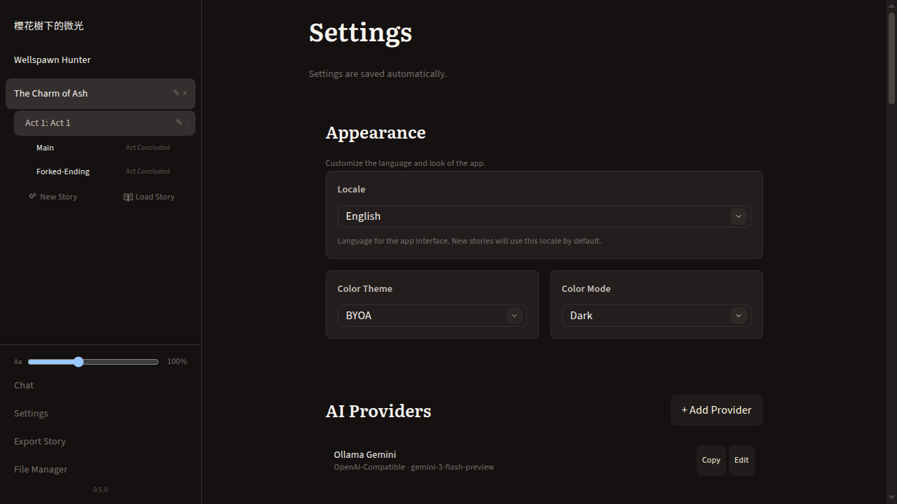
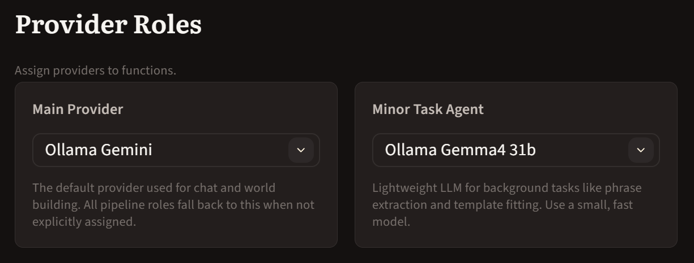
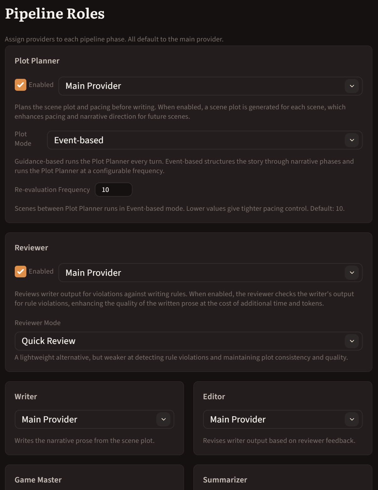
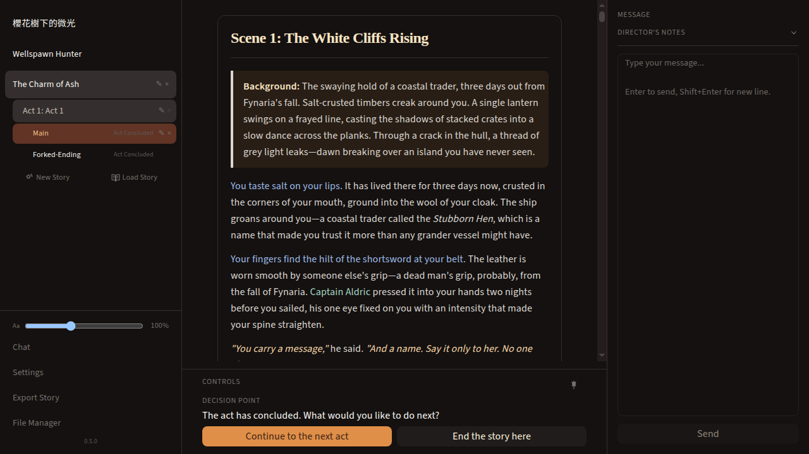
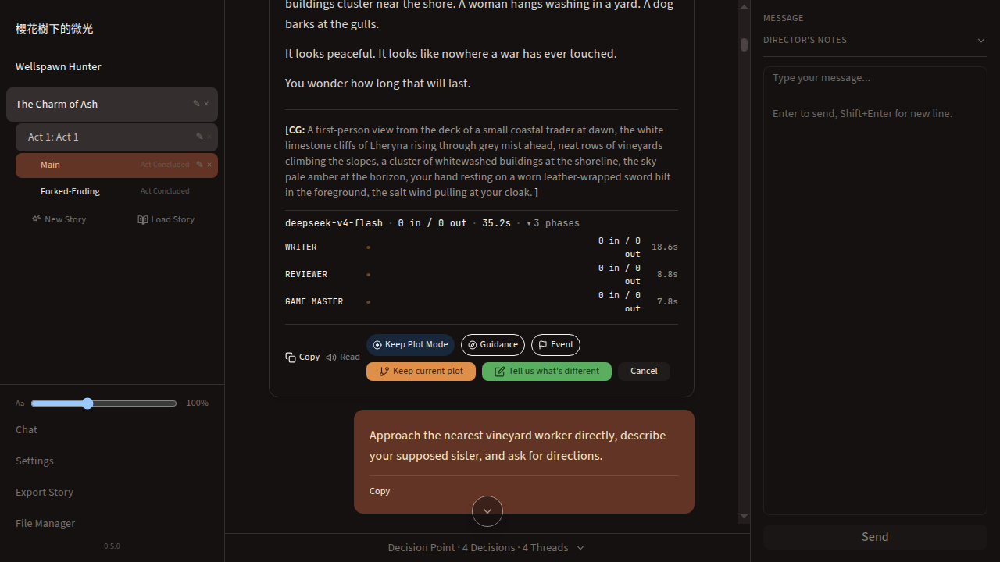
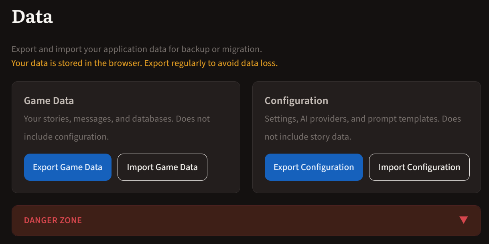
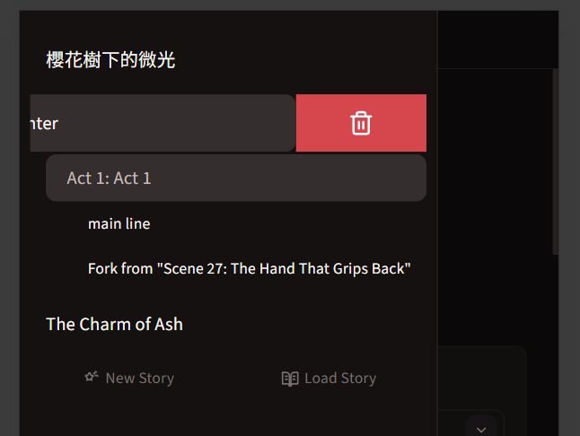
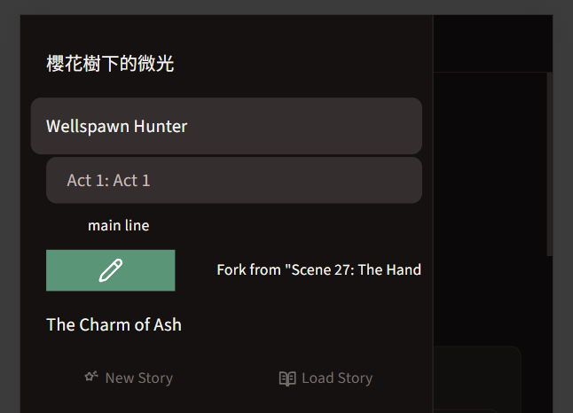

# BYOA — Build Your Own Adventure

An AI-powered interactive storytelling app built with [Tauri v2](https://v2.tauri.app/) and [SvelteKit 5](https://kit.svelte.dev/). Create stories through an AI-guided world builder, then play through branching narratives with real-time game state tracking.

## Features

### Narrative Engine

- **Multi-Phase Pipeline** — Writer → Reviewer → Editor → Game Master + Plot Planner (sequential), with async Summarizer, Character Profile Compressor, and Memory extraction
  - **Write-Review-Edit** Optional feedback loop to keep up the quality of the writing
- **Branching Narratives** — Fork storylines at any point; each branch is an independent act line sharing messages up to the fork point
- **Act Plots** — AI-generated scene-by-scene plot outlines with guided interview creation the drives the storytelling
- **Director Notes** — Player-initiated directorial guidance
- **Act Transitions** — AI-assisted bridging between acts with continuity checks
- **Risk Evaluation** — Dice-roll risk model for determining action outcomes

### World Building & Content

- **World Builder** — AI-guided interview that generates a story's world document
- **Import World** — Import chat transcripts (JSON, Markdown, text) as new stories with automatic act and character extraction
- **Character & Act Cards** — Extract characters from acts; generate cards with personality, appearance, and story arcs

### AI & Memory

- **Memory System** — Vector-based memory with semantic search (sqlite-vec); AI recalls past events, locations, and character interactions via `query-memories` tool
- **Important Phrase Highlighting** — Background LLM extraction of key narrative phrases, visually emphasized (gated by Minor Task Agent setting)
- **Editor Mode** — Optional AI reviewer that validates continuity, character consistency, and narrative quality

### Data Portability

- **Story Export/Load** — Per-story zip export with selective act line import (overwrite or as new story with ID remapping). Full app data backup/restore via Settings

### Configuration & UX

- **Wide API Provider Support** — OpenAI, OpenAI-compatible, Anthropic, Ollama, and local endpoints via `chat-completions` or `responses` API format
- **Multi-Provider Assignment** — Assign different models to different pipeline roles (Writer, Reviewer, Editor, Game Master, etc.)
- **Fully User-Customizable Prompts** — Edit bundled default prompts or create story-specific overrides via the File Manager; every AI-facing instruction can be tailored
- **Localization** — Three-tier system: `t()` for UI, `ls()` for LLM-facing strings, localized prompt/template files (English and Traditional Chinese)
- **Text-to-Speech** — Kokoro-based in-browser speech synthesis for narrative playback
- **Dynamic Typography** — Sidebar slider and Ctrl+scroll to adjust text size (70%–150%)

## User Guide

### 1. Running BYOA

| Option            | How                                                                                        | Recommendation    |
| ----------------- | ------------------------------------------------------------------------------------------ | ----------------- |
| **Installer**     | Download `BYOA_<version>.<ext>` (Windows `.exe`, Linux `.deb`/`.rpm`, macOS)               | Recommended       |
| **Dev server**    | `npm install && npm run dev`, then open browser                                            | Recommended       |
| **Built SPA**     | `npm install && npm run build`, then serve `build/` (e.g. `npx serve build`, Nginx, Caddy) | Recommended       |
| **Local desktop** | `npm install && npm run tauri dev` (requires Rust)                                         | For development   |
| **Online**        | [https://byoa.kazenor.in](https://byoa.kazenor.in) or self-hosted                          | No install needed |

> Not recommended: running the locally-built executable directly — the local data cache is not automatically erased between versions, which can cause stale data issues.

> Web app note:
>
> `localhost`/`127.0.0.1` is allowed on HTTP (e.g. http://localhost:1420); all other hosts require HTTPS.
>
> An HTTPS web app can only call HTTPS providers or localhost providers. Some providers (e.g. Ollama Cloud, Nvidia NIM) do not support CORS and will not work without a proxy.
> This app comes with support for a light-weight websocket-based proxying protocol WISP, see the AI Provider section for set up instructions.

### 2. Setting Up Your First AI Provider



Nothing works without a provider.

1. Go to **Settings → AI Providers** and click **+ Add Provider**
2. Choose a provider type: **OpenAI Compatible**, **OpenAI**, or **Ollama**
3. Fill in the **Base URL** and **Model** — use the **Fetch Models** button to auto-populate if your endpoint supports it
4. Select the correct **API type**: `chat-completions` for most providers, `responses` only for OpenAI's `responses` API

> Ollama (Local) users: set `OLLAMA_ORIGINS=*` on your Ollama server to allow browser CORS requests.

#### 2.1 WISP Proxy for WebApp

Since some API providers do not support CORS, any API requests to those providers would fail.

To overcome this, you would need some form of proxying.

This app comes with support for the [WISP-prototcol proxy](https://github.com/MercuryWorkshop/wisp-protocol).
You can set up a local WISP proxy with [wisp-server-python](https://github.com/MercuryWorkshop/wisp-server-python) to proxy API requests.

### 3. Assigning Provider Roles



All pipeline roles default to the **Main Provider**. You can assign different models to different roles for better results or cost control.

| Role                                                            | What it does                        | Tip                                                  |
| --------------------------------------------------------------- | ----------------------------------- | ---------------------------------------------------- |
| **Main Provider**                                               | Fallback for all unassigned roles   | Set your best model here                             |
| **Minor Task Agent**                                            | Phrase extraction, template fitting | Must be assigned for **Phrase Highlighting** to work |
| **Writer / Reviewer / Editor / GM / Plot Planner / Summarizer** | Individual pipeline phases          | Assign smaller/faster models to minor roles          |

Enable the **Reviewer** to unlock the **Editor** role assignment.



### 4. World Builder — Creating a Story

1. Click **New Story** → **World Builder**
2. Chat with the AI about your world (genre, setting, tone, key factions)
3. When the world is ready, choose:
   - **Start Immediately** — skips the act-plot interview and jumps straight into narrative
   - **Tell us about your story** — enters a guided act-plot interview for structured scene planning

> The act-plot interview is easy to miss but highly recommended for long or complex stories.

### 5. Playing the Narrative

The core loop: send a message → AI generates narrative → you choose a decision or enter one your own → repeat.

- When an act ends, choose **Continue to Next Act** or **End the Story**
  
- "Continue to Next Act": Will create a new Act continuing from this Act line
- "End the story here": Will write an Epilogue of the story for this Act

### 6. Message Actions

Every assistant message has action buttons:

- **Copy** — copy source Markdown text
- **Read** — text-to-speech (English stories only, enabled in Settings)
- **Fork** — branch the narrative from this point
- **Regenerate** — re-run the pipeline for this response
- **Edit** — opens structured fields (scene title, background, narrative, CG) for templated messages

> The Edit form reveals structured fields that aren't obvious when just reading the message.

### 7. Branching Narratives (Forking)



Forking lets you explore "what if" scenarios from any point in the story.

1. Click **Fork** on any assistant message
2. Choose how the branch diverges:
   - **Keep current plot** — continue with the same plot from the fork point
   - **Tell us what's different** — describe the divergence in an interview; the AI generates a new act plot for the branch
3. Optionally switch **Plot Mode** (Guidance → Event or vice versa)

### 8. Plot Planner & Act Plots

The Plot Planner shapes narrative direction before the Writer runs.

- Enable it in **Settings → Pipeline Roles**
- **Event-based mode** (recommended):
  - Structures the story through narrative phases
  - Prepares events and triggers that may or may not be triggered.
  - Runs at a configurable frequency (default every 10 scenes)
- **Guidance-based mode**:
  - Runs every turn to plan what to write next
  - Strong directional guidance, imagine modern Bethesda game story plots.
- An **act plot** is generated via **Tell us about your story** after World Building, or when you continue from a concluded act to a new act

### 9. Director Mode

Off by default. When enabled, a **Director Notes** panel appears in the input area.

- Add persistent notes to override the story's planned direction
- Set a **Scene range** (effective from/to) so notes apply only to specific scenes — this is easy to miss
- Toggle notes on/off without deleting them

> Director Notes strongly influence the plot and may trigger cascading cause-and-effect changes.

### 10. Story Export & Load

**Per-story export** (sidebar footer):

- Export as `.zip`
- Load Story page supports **selective act line import** — check/uncheck which branches to include
- Choose **Overwrite** or **Load as New**
  - **Overwrite** is will overwrite any conflicting act lines, while preserving act lines that does not exist in the imported source
  - **Load as New** is remap all IDs and the imported story will exist independently

**Full app backup** (Settings → Data):


- Export/import **Game Data** (stories, messages, databases)
- Export/import **Configuration** (providers, settings, prompt templates)

### 11. Mobile Navigation

On mobile, the UI is completely different:

- Swipe right from the left edge to open the **sidebar drawer**
- **Bottom tab bar**: Chat, Choices (with decision count badge), Menu
- Choose decisions from the **Choices** tab
- Swipe right-to-left on stories/acts/lines to delete: 
- Swipe left-to-right on stories/acts/lines to rename: 

### 12. Important Phrase Highlighting

When enabled, the "Minor Task Agent" will highlight important phrases in the prose.

Requires **both**:

1. The **Phrase Highlighting** toggle ON in Settings → Narrative
2. A **Minor Task Agent** assigned in Settings → Provider Roles

Phrases are extracted in the background (fire-and-forget) after each Editor phase. Older messages get backfilled when you load an act line.

### 13. Text-to-Speech

1. Enable **Text-to-Speech** in Settings
2. First use downloads the Kokoro TTS model (~300MB)
3. Only available for **English-locale stories** — the read-aloud icon won't appear for other languages
4. Choose voice and speed in Settings; use **Preview** to test before committing

### 14. World Builder — Importing Existing Content

Import chat transcripts, world cards, act cards and character as new stories:

- Supported: **Open WebUI JSON transcripts, Markdown, text files**
- Multi-step form: story details → acts/chapters → characters → settings → preview
- **Preview step**: review and remove individual messages before committing
- Auto-enters World Builder if the import determines the act plot needs guidance

Note: This is an expensive process in terms of requests and tokens.

### 15. Font Size & Appearance

- **Ctrl+Scroll** to adjust text size (70%–150%)
- Or use the **Aa** slider in the sidebar
- 23 color themes + System/Light/Dark mode
- Languages: English and Traditional Chinese (Hong Kong)

### 16. File Manager

**File Manager** (sidebar link) lets you browse and edit the app's data directory:

- Browse story folders, prompt templates, and generated files
- Managed config files: **Restore Default** reverts overrides; **Copy to Story** makes a story-specific copy
- Protected directories cannot be deleted
- Edit and save text files directly

> Common use case: Overriding general-instructions.md
> 
> General Instructions is the main component of the system prompt. Overriding it allows you to define how the assistants work.
> The file is located in `config/<local>/prompt-templates/general-instructions.md`.

> Note: when using the Desktop App, the files are stored in the user's App Data directory.
> 
> On Windows, App Data is located in `%APPDATA%/in.kazenor.byoa-app` and `%LOCALAPPDATA%/in.kazenor.byoa-app`
> 
> On Linux, it is located in `~/.config/in.kazenor.byoa-app` and `~/.local/share/in.kazenor.byoa-app`

### 17. Memory System

Advanced feature, disabled by default. Not available in the web app (no `sqlite-vec` in browser).

- Requires both a **Memory provider** and an **Embedding provider**
- Memory extraction runs automatically after narrative generation
- **Memory Manager** page: search by character, location, or both
- Regenerate memories or reset (danger zone)

> Memory is useful for very long stories but not needed to get started.

---

## Developer Guide

### Prerequisites

| Tool                                            | Version |
| ----------------------------------------------- | ------- |
| [Node.js](https://nodejs.org/)                  | v24+    |
| [Rust](https://www.rust-lang.org/tools/install) | 1.77.2+ |

#### Linux system dependencies

Tauri requires WebKit2GTK and related libraries on Linux:

```bash
sudo apt install -y libwebkit2gtk-4.1-dev build-essential curl wget file \
  libxdo-dev libssl-dev libayatana-appindicator3-dev librsvg2-dev
```

### Development

```bash
npm install
npm run tauri dev
```

This starts the Vite dev server on `http://localhost:1420` and launches the Tauri window with hot-reload.

#### Rust Installation (WSL2)

Before working on the Tauri backend, ensure Rust is installed in WSL2:

1. **Install build dependencies** — Rust crates often compile from source:

   ```bash
   sudo apt update && sudo apt install build-essential gcc make -y
   ```

2. **Run the official rustup installer**:
   ```bash
   curl --proto '=https' --tlsv1.2 -sSf https://sh.rustup.rs | sh
   ```
   When prompted, type `1` (default installation) and press Enter.

### Building a Linux Binary

```bash
npm run tauri build
```

Output artifacts:

| Artifact | Plaform | Path                                                                |
| -------- | ------- | ------------------------------------------------------------------- |
| Binary   | All     | `src-tauri/target/release/app`                                      |
| .deb     | Linux   | `src-tauri/target/release/bundle/deb/BYOA_<version>_amd64.deb`      |
| .rpm     | Linux   | `src-tauri/target/release/bundle/rpm/BYOA-<version>-N.x86_64.rpm`   |
| .msi     | Windows | `src-tauri/target/release/bundle/msi/BYOA_<version>_x64_en-US.msi`  |
| .exe     | Windows | `src-tauri/target/release/bundle/nsis/BYOA_<version>_x64-setup.exe` |

### Building the Standalone Web App

The same codebase produces a standalone web app that runs in any modern browser without Tauri. Runtime detection automatically selects the correct backends:

| Layer               | Tauri                                       | Web (browser)                                    |
| ------------------- | ------------------------------------------- | ------------------------------------------------ |
| Database            | `TauriDatabase` (native SQLite)             | `SqlJsDatabase` (WASM SQLite + OPFS persistence) |
| File system         | `TauriFileSystem` (`@tauri-apps/plugin-fs`) | `OpfsFileSystem` (browser OPFS API)              |
| HTTP                | `@tauri-apps/plugin-http` (CORS-free)       | `globalThis.fetch` (subject to CORS)             |
| Logging             | Tauri log plugin                            | Console + file via OPFS                          |
| Memory (sqlite-vec) | Enabled                                     | Disabled                                         |

#### Build

```bash
npm install   # postinstall copies sql-wasm.wasm to static/
npm run build # outputs to build/
```

The `build/` directory is a fully static SPA — deploy it to any static host (Netlify, Vercel, GitHub Pages, S3) or serve locally with `npx serve build`.

#### Requirements

- **HTTPS or localhost** — OPFS requires a secure context. `file://` protocol will not work.
- **Chromium-based browser** — OPFS and File System Access API are primarily supported in Chrome, Edge, and Opera. Firefox and Safari have limited or no support.
- **CORS** — LLM API calls use standard `fetch()`. Most providers (OpenAI, Anthropic) work fine. Self-hosted endpoints (especially Ollama) may require CORS configuration.

#### Data persistence

App data is stored in the browser via OPFS (Origin Private File System). Clearing browser data will erase it. Use the **Data → Export** button in Settings to create backups.

#### PWA

The web build includes a service worker (via `@vite-pwa/sveltekit`) that caches the app shell for offline use. On Chromium browsers, the app can be installed as a PWA via the browser's install prompt.

#### CORS note for Ollama

When running in the browser, API calls to local Ollama instances require the `OLLAMA_ORIGINS=*` environment variable to allow cross-origin requests.

### Cross-Compiling for Windows (from Linux)

Cross-compiling to Windows uses the GNU toolchain with MinGW-w64.

#### 1. Install dependencies

```bash
# Add the Windows GNU target to Rust
rustup target add x86_64-pc-windows-gnu

# Install MinGW-w64 cross-compiler and NSIS installer builder
sudo apt install -y gcc-mingw-w64-x86-64 nsis
```

#### 2. Build the Windows binary and installer

```bash
npm run tauri build -- --target x86_64-pc-windows-gnu
```

The `.exe` includes the embedded frontend assets and requires [WebView2](https://developer.microsoft.com/en-us/microsoft-edge/webview2/) (pre-installed on Windows 10/11).

### Project Structure

```
src/                      # SvelteKit frontend
  lib/
    ai/                   # AI pipeline, streaming, tools
      pipeline/           # Multi-phase narrative pipeline (orchestrator, runners, phase executor, summarizer)
      act-plot/           # Act plot generation and interview
      tools/              # AI tool definitions (read-scene, query-memories, evaluate-risk, etc.)
      world-generator/    # World document generation and updating
      chat/               # Chat pipeline config and provider resolution
    features/             # Feature modules
      world-builder/      # AI-guided world-building interview
      import-world/       # Import transcript feature
      character-card-generator/  # Character card extraction and generation
      act-card-generator/ # Act card generation
      story-export-load/  # Story .byoa archive export/import
      turn-of-events-generator/  # AI-generated narrative twists
      memory/             # Vector memory persistence and search
      act-transition.svelte.ts  # Act transition orchestration
      fork-controller.svelte.ts # Act line forking control
      message-editor.svelte.ts  # Message editing UI state
      data-import-export.ts     # Settings and data export helpers
    chat-stream-parser/   # Descriptor-based extraction from LLM markdown output
    db/                   # SQLite repositories (messages, stories, acts, act-lines, memory)
      adapters/           # Database adapter layer (Tauri vs web)
    definitions/          # Pipeline headers, labels, prompts, error messages
    fs/                   # Prompt loading, view templates, story folders
      prompts/            # Bundled default markdown templates (by category)
    stores/               # Reactive state — settings, stories, act/character cards, memory
    i18n/                 # UI translation (t() function, locale JSON files)
    localization/         # LLM locale strings (ls() function, YAML-backed)
    kokoro/               # TTS engine (Kokoro WASM, Web Audio playback)
    logging/              # Structured logging (Tauri + file output)
    http/                 # HTTP fetch abstraction
    components/           # Shared Svelte components (MarkdownContent, ChatControls, etc.)
    utils/                # Async utilities, error handling, dialogue preprocessor
    ui/                   # UI constants (icon definitions)
    styles/               # Theme CSS
  routes/
    +page.svelte          # Chat UI + world builder
    settings/             # Multi-provider, pipeline roles, feature toggles
    generate-character-cards/  # Character card generation
    import-world/         # Import transcript as new story
    load-story/           # Load .byoa archive
    memory-manager/       # Memory regeneration UI
    file-manager/         # Story file management
src-tauri/                # Tauri (Rust) backend
  src/
    lib.rs                # Tauri setup and command handlers
    main.rs               # Entry point (sqlite-vec auto-extension registration)
svelte.config.js          # adapter-static (SPA fallback)
vite.config.ts            # Vite dev server on port 1420
```

### Feature Internals

#### Dialogue Preprocessor

**`src/lib/utils/dialogue-preprocessor.ts`** — `preprocessDialogue(content, characterNames?, importantPhrases?)` applies highlighting with strict precedence:

**dialogue > highlighted-phrase > character-name**

Each layer masks its regions so subsequent passes can't match inside them.

#### Important Phrase Highlighting

Background LLM extraction + UI highlighting. After Editor phase, `extractImportantPhrases()` runs via MinorTaskAgent (fire-and-forget). On `sendMessage()` completion, the promise is resolved and phrases are persisted. On `loadActLineMessages()`, missing phrases are backfilled sequentially. `MarkdownContent.svelte` passes phrases to `preprocessDialogue()`.

#### Vector Data Types (sqlite-vec)

The `sqlite-vec` extension is available in all SQLite connections (registered process-globally via `main.rs`). All sqlite-vec SQL functions and the `vec0` virtual table module are available from JavaScript SQL queries.

#### Constraints

- **vec0 schema requires explicit dimension**: `float[N]` (e.g., `float[768]`), not bare `float`.
- **Vectors as JSON strings**: `tauri-plugin-sql` IPC cannot bind binary BLOBs from JavaScript. Pass vectors as JSON strings — sqlite-vec parses them natively.
- **Integer primary keys only**: Use `last_insert_rowid()` in SQL instead of passing rowids from JavaScript (JS `number` binds as REAL through IPC).
- **KNN queries require LIMIT on vec0 scan**: When JOINing with other tables, use a subquery pattern so the `LIMIT` is directly on the vec0 virtual table scan.

#### Example Usage (JavaScript)

```sql
-- Create a vector table
CREATE VIRTUAL TABLE vec_items USING vec0(embedding float[768]);

-- Insert (vector as JSON string)
INSERT INTO vec_items(rowid, embedding) VALUES (1, '[0.1, 0.2, ...]');

-- Search (top 5 closest by cosine distance)
SELECT rowid, distance
FROM vec_items
WHERE embedding MATCH '[0.3, 0.1, ...]'
ORDER BY distance
LIMIT 5;
```

### License

ISC
